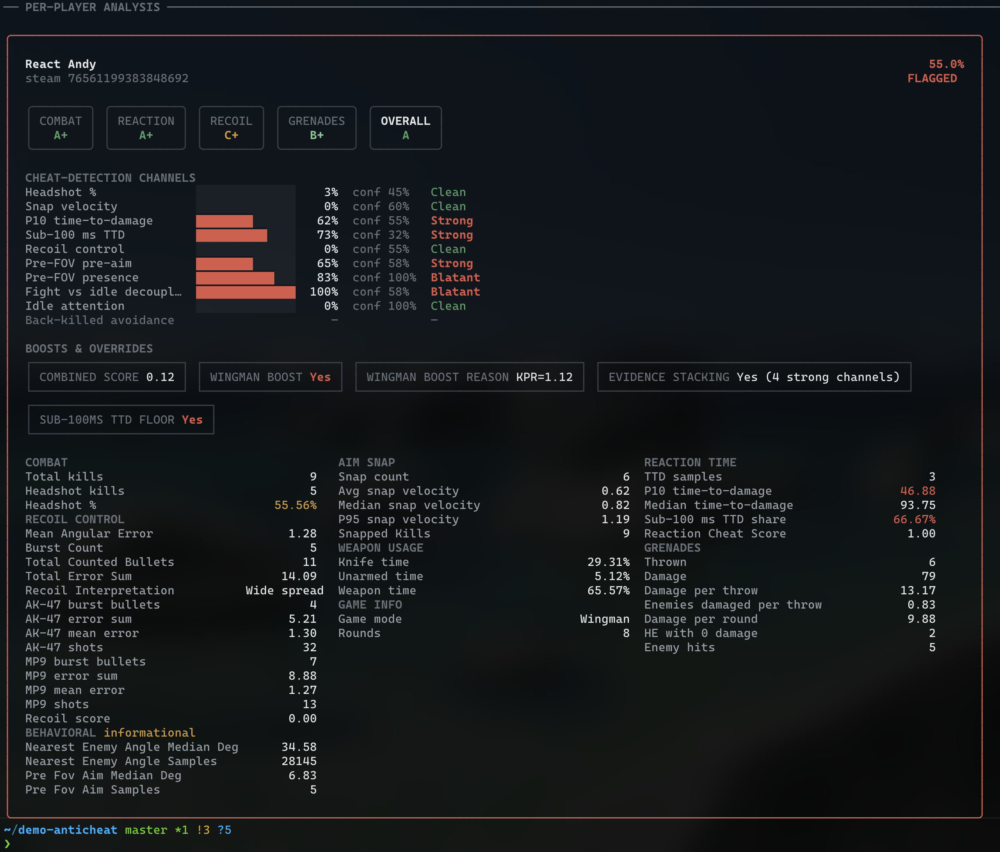

# demo-anticheat

**CS2 Demo Automated Cheat Detection**
_Statistical analysis of Counter-Strike 2 demos. Every flag backed by metrics you can read._

---

## Features

- Parses the current CS2 demo format (late 2025 / 2026 onward — see [Compatibility](#compatibility))
- **10-channel Bayesian cheat detector** with lobby-relative normalization, channel-by-channel confidence weights, and a transparent log-odds combiner — no black-box weighting
- Per-player metrics across aim mechanics, reaction time, recoil control, grenade usage, scoreboard activity, and **wallhack-targeted behavioral signals** (pre-FOV pre-aim, fight-vs-idle decoupling, back-kill avoidance)
- Auto-detects Wingman vs. Competitive; Wingman uses a KPR-based boost so short matches still score correctly
- CS2-style scoreboard with team split (K/D/A/ADR/MVP) and **scoreboard-position discount** for consistent bottom-fraggers
- Per-category **skill grades** (A+ → F) plus an overall composite, highlighted as badges in the HTML report
- Self-contained HTML report (`--html`) with masonry-balanced category layout, per-channel score/confidence/zone bars, and a boosts/overrides strip
- Modular collectors — add a new metric in well under 100 lines

---

## Getting Started

### Install

Requires Go ≥ 1.24.

```sh
git clone https://github.com/timanthonyalexander/demo-anticheat
cd demo-anticheat
go build
```

Or grab a prebuilt binary from the [latest release](https://github.com/TimAnthonyAlexander/demo-anticheat/releases/latest) — darwin/linux/windows on amd64 and arm64.

### Analyze a Demo

```sh
./demo-anticheat analyze path/to/demo.dem
```



The terminal output above is the default rendering for an analyzed cheater demo — the flagged player's card is bordered in red, each detection channel shows a colored score bar with its confidence and zone, skill grades render as inline badges, and the boost/override strip explains every adjustment that shaped the final likelihood. Output auto-degrades to plain ASCII when piped or redirected, and honors `NO_COLOR`.

### HTML Report

Pass `--html` (or set `DEMOANTICHEAT_HTML=1`) to also write a self-contained `index.html` next to the text output.

```sh
./demo-anticheat analyze --html path/to/demo.dem
```


A sample report from a cheater demo is committed at [`index.html`](./index.html). View it rendered via [htmlpreview](https://htmlpreview.github.io/?https://github.com/timanthonyalexander/demo-anticheat/blob/master/index.html), or download the raw file and open it directly — it's a single self-contained file with no JS or external assets.

---

## Detection Methodology

Every player gets a **composite cheat-likelihood score** (0–100%). Scores ≥ **50%** auto-flag as `Cheater: Yes`. The score comes from a Bayesian log-odds combiner over independent evidence channels:

```
prior     = logit(0.10)                            # 10% base-rate cheater probability
contrib_i = w_i × confidence_i × logit(score_i)    # per-channel evidence
L         = prior + Σ contrib_i
likelihood = sigmoid(L) × 100
```

Then game-mode boosts, scoreboard-position discount, evidence-stacking, and a TTD-sub100 high-confidence floor apply in order. Sniper-anomaly overrides pin to 100% when triggered.

Channels run in one of two modes:

- **Bidirectional** (`hs`, `reaction`, `pre_fov`): a clean reading is real evidence of cleanness — contributes negative log-odds.
- **Positive-only** (`snap`, `recoil`, `ttd_sub100`, `attention`, `back_killed`, `pre_fov_presence`, `decoupling`): a clean reading contributes 0. A clean snap or clean recoil doesn't exonerate — it just means we didn't see that particular cheat signature.

### Channels

| Channel | What it measures | Clean → Blatant | Weight |
|---|---|---|---:|
| `hs` | Headshot rate | 55% → 75% | 0.18 |
| `snap` | P95 snap velocity (°/ms) | 2.0 → 3.5 | 0.12 |
| `reaction` | P10 time-to-damage (ms) — sight via CS engine LoS to first damage | 400 → 100 | 0.10 |
| `ttd_sub100` | Share of engagements completing in under 100 ms | 2% → 30% | 0.10 |
| `recoil` | Spray-pattern angular deviation vs. known AK / M4A4 / M4A1-S / MP9 / P90 patterns | 0.75° → 0.20° | 0.10 |
| `pre_fov` | Median angle between killer's crosshair and victim's position 200 ms before FOV entry | 12° → 4° | 0.20 |
| `pre_fov_presence` | Sample count × lobby asymmetry — a player who pre-aimed tight angles many times when teammates / opponents didn't | (gated) | 0.10 |
| `attention` | Median crosshair-to-nearest-enemy angle during off-engagement frames | 33° → 18° | 0.06 |
| `back_killed` | % of own deaths where the player was looking away from the killer (low = suspicious) | 25% → 3% | 0.06 |
| `decoupling` | `attention_median − pre_fov_median` — tight in fights but loose when chilling | 8° → 22° | 0.10 |

The `decoupling` channel is the one nobody else publishes. Wallhackers concentrate during engagements but their crosshair drifts during chill/walking; legit players are consistent across both phases. Both halves come from existing per-frame metrics, no extra parsing.

### Boosts, discounts, and overrides

- **Wingman boost (×1.8)** when `KPR ≥ 0.7 OR kills ≥ 10`. KPR keeps short Wingman demos that end at 8–9 rounds from slipping past the gate.
- **Competitive boost (×1.2)** when `kills > 39` in ≤ 30 rounds.
- **Position discount (× up to 0.80)** for consistent bottom-of-team players — same cheat signals are statistically less likely on a bottom-fragger than a top-fragger.
- **Evidence stacking (×1.4)** when ≥ 3 channels each register `score × confidence ≥ 0.30`. Independent moderate signals compound the way the underlying probability model says they should.
- **TTD-sub100 high floor (≥ 55%)** when sub-100ms TTD rate ≥ 25% on ≥ 3 samples AND a pre-FOV pattern is present AND the lobby is asymmetric in pre-FOV samples. All four gates required — peeker's-advantage pre-fires alone don't trip it.
- **Sniper-anomaly overrides (pin to 100%)**: >10 sniper wallbang kills, or >10 Scout kills with ≥ 80% HS rate.

### Lobby-relative normalization

Per channel, drop the highest-scoring lobby member, take the mean of the rest, and shrink everyone's score by 40% of that trimmed mean. A tight clean lobby where every player has good preaim pulls everyone down; a lobby with one outlier keeps the outlier visible. Skipped when fewer than 2 players have meaningful data on a channel.

### Ground truth and regression tests

`pkg/analyzer/detector_test.go` runs 10 tests against three reference demos:

| Demo | Players | Status |
|---|---|---|
| `walls_wingman.dem` (2v2 Wingman) | 2 confirmed wallhackers, 2 confirmed clean teammates | flagged / not flagged |
| `wallhack_trigger_ban_wingman.dem` (2v2 Wingman) | 1 confirmed wallhack+triggerbot cheater (same SteamID as the first demo's lead cheater — different demo of the same player), 3 clean | flagged / not flagged |
| SHADE vs Kultywator (5v5 Premier) | 10 confirmed-clean pros | none flagged |

The test suite enforces a **≥ 10-point margin** between the lowest-scoring known cheater and the highest-scoring clean pro. Current margin on the reference set is **~44 points**. Tests skip cleanly if the reference demos aren't checked in locally — run with `go test ./...`.

Every flag publishes the per-channel score, confidence, and zone under the `anti_cheat` category, so you can read the math.

### Skill grades

Independent of cheat detection, each player gets an **A+ → F** grade per category (Combat / Reaction / Recoil / Grenades) plus an overall composite. Thresholds are calibrated to a wide Faceit L4–L10 player distribution; useful for relative ranking within a demo, not absolute skill measurement. The HTML report renders these as highlighted badges at the top of each player card.

---

## Extending With New Statistics

Two ways to add to the analysis:

**1. Add a new metric collector** (anything that reads the demo per-frame or via events and writes metrics):

1. Implement the `stats.Collector` interface.
2. Register your collector in `pkg/analyzer/analyzer.go`. Order matters — collectors that depend on others' final metrics must register after them. `CheatDetector` registers last.
3. Your metric appears in the per-player text + HTML report automatically.

```go
type MyStatsCollector struct {
    *stats.BaseCollector
}

func NewMyStatsCollector() *MyStatsCollector {
    return &MyStatsCollector{
        BaseCollector: stats.NewBaseCollector("My Stats", stats.Category("my_category")),
    }
}

func (c *MyStatsCollector) CollectFrame(parser demoinfocs.Parser, demoStats *stats.DemoStats) {
    // Per-frame logic
}

func (c *MyStatsCollector) CollectFinalStats(demoStats *stats.DemoStats) {
    // End-of-demo aggregation
}
```

See `pkg/stats/behavioral_collectors.go` for a richer example using event subscriptions and per-player rolling history.

**2. Add a new cheat-detection channel** (a signal that should feed the cheat-likelihood verdict):

The scoring pipeline lives in `pkg/stats/cheatscore_*.go`:

- `cheatscore_channel.go` — `Channel` struct, `Zone` enum, confidence helpers.
- `cheatscore_channels.go` — one `evaluate*()` function per channel.
- `cheatscore_combiner.go` — Bayesian log-odds combiner + lobby normalization.
- `cheatscore_overrides.go` — Wingman / Competitive / position / stacking / floor / sniper rules.
- `cheatscore_publish.go` — per-channel transparency keys under `anti_cheat`.
- `cheatscore_score.go` — top-level `cheatscoreEvaluate(demoStats)` pipeline.

Add a new `evaluateMyChannel()` returning a `Channel{ID, Score, Confidence, Raw, SampleN, Weight, Mode, HasData}`, append it to `evaluateChannelsForPlayer`, and the rest of the pipeline picks it up. Re-run `go test ./...` to keep the regression set green.

---

## Compatibility

| Tool version | CS2 demo format |
|---|---|
| **v2.x** | Current (late 2025 / 2026 onward) |
| v1.x | Pre-late-2025 only — crashes on newer demos (`unable to find existing entity inside sendtables2`) |

v2.0.0 upgraded to `demoinfocs-golang v5` for the new wire format. Use v2.x for any modern demo.

---

## Philosophy

Objective, transparent, extensible. Every verdict is backed by statistics you can read and tune — not a black box. The Bayesian combiner is a deliberate replacement for a weighted sum: independent moderate signals are supposed to compound, and the per-channel confidence weights are honest about how much data each measurement actually has. Use as-is, adjust the weights, or treat as a baseline for ML-based detection.

---

## Contributing

PRs and metric ideas welcome. Add a collector or a channel, document your math, show your work. If you tune the detector, keep `detector_test.go` green — the regression set is the contract.

---

## License

MIT. Issues, bugs, suggestions: open an issue or contact Tim at info@t17r.com.
