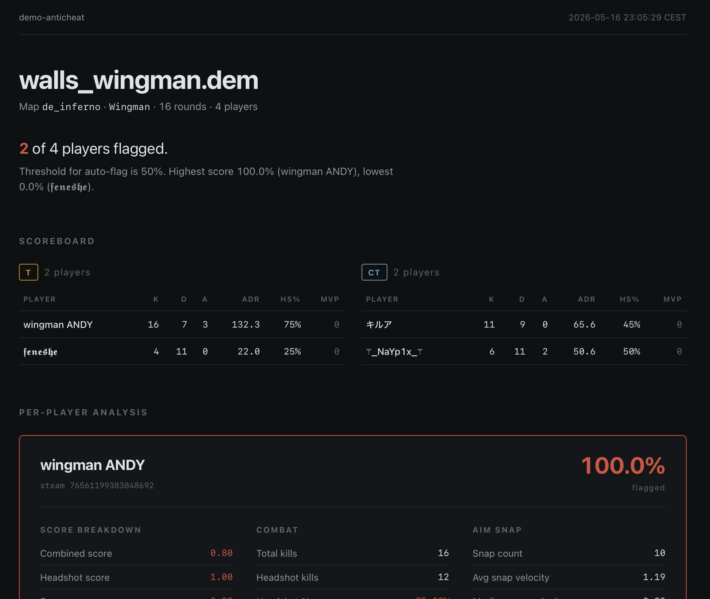

# demo-anticheat

**CS2 Demo Automated Cheat Detection**
_Statistical analysis of Counter-Strike 2 demos. Every flag backed by metrics you can read._

---

## Features

- Parses the current CS2 demo format (late 2025 / 2026 onward — see [Compatibility](#compatibility))
- Per-player metrics: weapon usage, headshot rate, snap-angle velocity, **time-to-damage** (LoS-based, Leetify-aligned), recoil control, HE grenade usage, behavioral signals
- Composite cheat-likelihood score, calibrated against ground-truth-labeled demos
- Auto-detects Wingman vs. Competitive and adjusts scoring accordingly
- CS2-style scoreboard with team split (K/D/A/ADR/MVP) and **scoreboard-position discount** for consistent bottom-fraggers
- Per-category **skill grades** (A+ → F) plus an overall composite
- Self-contained HTML report (`--html`); modular collectors — add a new metric in well under 100 lines

---

## Getting Started

### Install

Requires Go ≥ 1.24.

```sh
git clone https://github.com/timanthonyalexander/demo-anticheat
cd demo-anticheat
go build
```

### Analyze a Demo

```sh
./demo-anticheat analyze path/to/demo.dem
```

### HTML Report

Pass `--html` (or set `DEMOANTICHEAT_HTML=1`) to also write a self-contained `index.html` next to the text output.

```sh
./demo-anticheat analyze --html path/to/demo.dem
```



A sample report from `demos/walls_wingman.dem` is committed at [`index.html`](./index.html). View it rendered via [htmlpreview](https://htmlpreview.github.io/?https://github.com/timanthonyalexander/demo-anticheat/blob/master/index.html), or download the raw file and open it directly — it's a single self-contained file with no JS or external assets.

---

## Detection Methodology

Every player gets a **composite cheat-likelihood score** (0–100%). Scores ≥ **50%** auto-flag as `Cheater: Yes`. The threshold is calibrated against ground-truth-labeled demos:

- 2 confirmed Wingman wallhackers — both auto-flag
- 12 confirmed clean players (2 Wingman teammates + 10 pros from a 5v5 reference demo) — none flag

A regression test suite (`pkg/analyzer/detector_test.go`) enforces a ≥ 10% margin between the lowest-scoring known cheater and the highest-scoring clean pro. Current margin on the reference set is **32pts**: both Wingman wallhackers flag at 100% / 72%, max clean pro sits at 40%. Run with `go test ./...` — tests skip cleanly if the reference demos aren't checked in locally.

### Signals

| Category | What it measures |
|---|---|
| **Weapon usage** | % of time on knife / weapon / unarmed |
| **Headshots** | HS rate, gated to ≥ 10 kills to avoid small-sample noise |
| **Snap angle** | View-angle velocity (°/ms): avg, median, P95 |
| **Time-to-Damage** | Per Leetify's methodology: first sight (CS engine LoS via `m_bSpottedByMask` — real per-tick TraceLine visibility) to first damage. Reports median, P10, sub-100 ms ratio. 1000 ms engagement cap. |
| **Recoil control** | Spray-pattern angular deviation against known weapon recoil for AK-47, M4A4, M4A1-S, MP9, P90. Per-weapon shot counts match authoritative tools. |
| **Grenades (HE)** | Throws, damage, damage-per-throw, kills, **HEs with zero damage** — a player landing every HE on enemies (no zero-damage throws over many attempts) implies info advantage. |
| **Scoreboard position** | Rank within team at round 5 / halftime / end. Consistent bottom-fraggers get up to a 20% likelihood discount — a bottom-team player with strong cheat signals is statistically less likely than a top-fragger with the same signals. |
| **Behavioral (informational)** | Back-killed %, pre-FOV pre-aim°, off-engagement attention° — wallhack-targeted signals, **not yet included in the score**: at 2v2 Wingman sample sizes they don't reliably separate cheaters from skilled clean players. Emitted so a larger corpus can calibrate them later. |
| **Game context** | Wingman vs. Competitive auto-detection; Wingman gets a 1.8× score boost above 10 kills (tighter outlier space — 2 enemies, smaller maps, shorter rounds) |

Every flag prints the per-signal contributions, so you can read the math.

### Skill grades

Independent of cheat detection, each player gets an **A+ → F** grade per category (Combat / Reaction / Recoil / Grenades) plus an overall composite. Thresholds are calibrated to a wide Faceit L4–L10 player distribution; useful for relative ranking within a demo, not absolute skill measurement.

---

## Extending With New Statistics

1. Implement the `stats.Collector` interface.
2. Register your collector in `pkg/analyzer/analyzer.go`.
3. Your metric appears in the per-player report automatically.

```go
type MyStatsCollector struct {
    *stats.BaseCollector
}

func NewMyStatsCollector() *MyStatsCollector {
    return &MyStatsCollector{
        BaseCollector: stats.NewBaseCollector("My Stats", stats.Category("my_category")),
    }
}

func (c *MyStatsCollector) CollectFrame(parser demoinfocs.Parser, demoStats *stats.DemoStats) {
    // Per-frame logic
}

func (c *MyStatsCollector) CollectFinalStats(demoStats *stats.DemoStats) {
    // End-of-demo aggregation
}
```

See `pkg/stats/behavioral_collectors.go` for a richer example using event subscriptions.

---

## Compatibility

| Tool version | CS2 demo format |
|---|---|
| **v2.x** | Current (late 2025 / 2026 onward) |
| v1.x | Pre-late-2025 only — crashes on newer demos (`unable to find existing entity inside sendtables2`) |

v2.0.0 upgraded to `demoinfocs-golang v5` for the new wire format. Use v2.x for any modern demo.

---

## Philosophy

Objective, transparent, extensible. Every verdict is backed by statistics you can read and tune — not a black box. Use as-is, adjust the weights, or treat as a baseline for ML-based detection.

---

## Contributing

PRs and metric ideas welcome. Add a collector, document your math, show your work. If you tune the detector, keep `detector_test.go` green.

---

## License

MIT. Issues, bugs, suggestions: open an issue or contact Tim at info@t17r.com.
